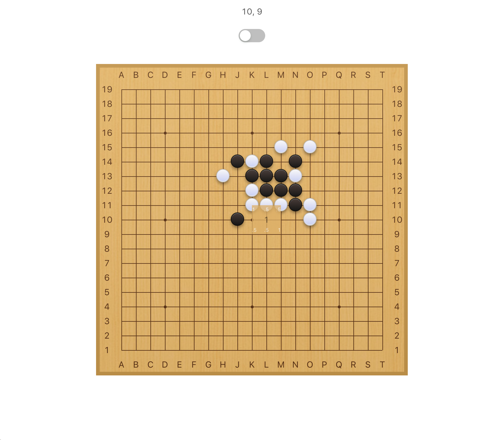

# ⚫️⚪️ Gomoku AI




## 🧠 Gomoku Brain
> You must be in [`gomoku/`](./gomoku) folder.

### 📋 Requirements
- [python3](https://www.python.org/downloads/)
- [pip3](https://pip.pypa.io/en/stable/reference/pip_download/) *(if you want to use ui-debug)*

### 📦 Install
```bash
make install # only if you want to use ui-debug
make build
```

### 🚀 Run
> The brain is an implementation of [piskvork protocol](http://petr.lastovicka.sweb.cz/protocl2en.htm) and can be use with the [piskvork](https://sourceforge.net/projects/piskvork/) software only on windows.
> However you can use the [ui-debug](../ui-debug/README.md) on any platform to interact with this AI.

```bash
./pbrain-gomoku-ai
```

<br />

## 🖥 Gomoku UI
> You must be in [`ui-debug/`](./gomoku) folder.

### 📋 Requirements
- [node](https://nodejs.org/en/download/)

### 📦 Install
```bash
npm install
```

### 🚀 Run
> This UI has been used during the development of AI to debug internal variables graphicaly. But you can also you it to play against my AI.

```bash
npm start
```

<br />

## 📝 TODO
- [ ] Implement an [Alpha-Zero](https://deepmind.com/blog/article/alphago-zero-starting-scratch) AI like

<br />

*have fun ! 😎*
